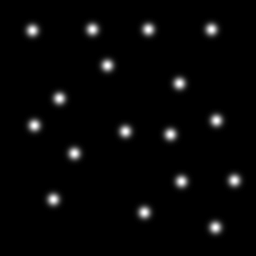
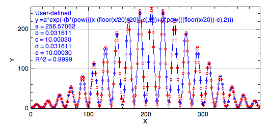

# General Macros for Fiji (ImageJ)

This collection of macros is to help with tricky or interesting problems using the image analysis package Fiji (ImageJ.
##### General Requirements:
Macros written for Fiji/ImageJ. If don't have Fiji, you can download  it here: imagej.net/Fiji/Downloads

------------------

### FWHM along a line. 
Script location in GIST: [WHM_along_line_v1.ijm](https://gist.github.com/dwaithe/2b9581324e3c8caf9238765ce50127fb).  
Example file to test script: [2.lif](https://drive.google.com/file/d/1mQ1yezSlPRWksWduzm6WNVTeg0uZU1Qs/view?usp=sharing).   
#### Description:  
A bulk FWHM measuring algorithm was designed and written using ImageJ macro language. Using the ImageJ interface the user defines a line using the Segmented line tool which follows the contour of the GUV to be measured. The algorithm is then run and will interpolate along the user-defined line and calculates points at regular intervals (3 pixel gap). At each interpolated point on the line a perpendicular lines is drawn 40 pixels in length and centred on the interpolated line. Along each of these perpendicular lines the intensity values are sampled and a Gaussian curve is fit using the ImageJ curve fitting plugin. The parameters of each curve are then output and the FWHM calculated for each curve (2*sqrt(2*log(2)*sigma), where sigma of Gaussian fit).  

------------------

### Macro script for fitting 2D Gaussians (Diagonally covariant)
Script location in GIST: [2D_GaussFit.ijm](https://gist.github.com/dwaithe/186f910ebf58f65ebd26ff4692b00ee3).   
Example file to test script:[2D_Gaus_sig4.png](resources/2D_Gaus_sig4.png).  

with example file:

#### Description: 
This script includes a rough feature detection using the in built Find Maxima algorithm and then fine 2D Gaussian algorithm to fit Gaussians within square patch regions. This macro is special because the ImageJ/Fiji curve fitting API only supports 1-D curve. I get around this by linearising the equation. The equation is for isotropic (spherical) or anistropic (longer in x/y) diagonally covariant Gaussians but not fully covariant Gaussians (anisotropic and rotated), I will include that in another script. There are further instructions and parameters in the macro itself.
Based on https://en.wikipedia.org/wiki/Gaussian_function two-dimensional Gaussian function.

------------------
### Macro for converting a folder of images to another format.
Script location in GIST: [file_converter.ijm](https://gist.github.com/dwaithe/526eb15b06fa88e4981d70d3c1a73b60). 
#### Description:
Simple example script which shows how to convert .lsm files from one folder into another folder and save as ome.tiff

